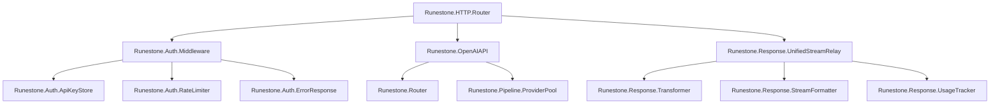
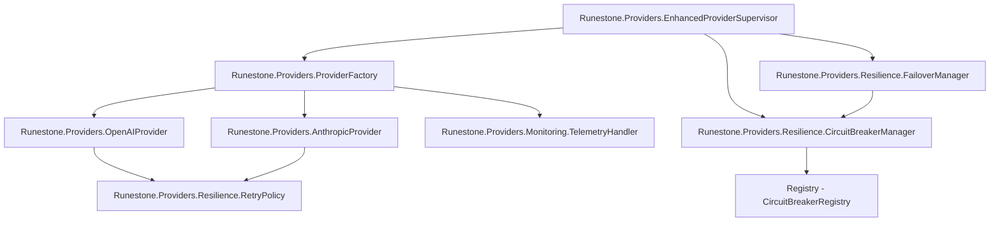
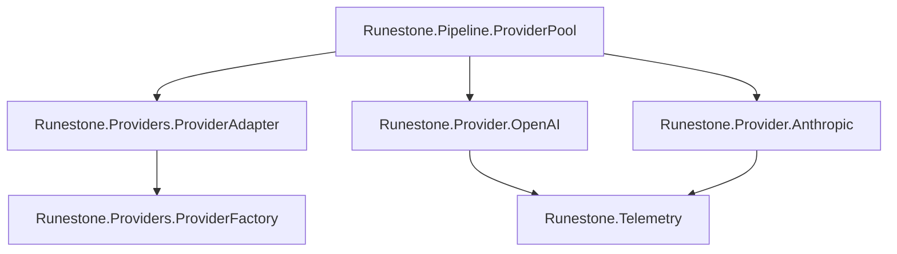
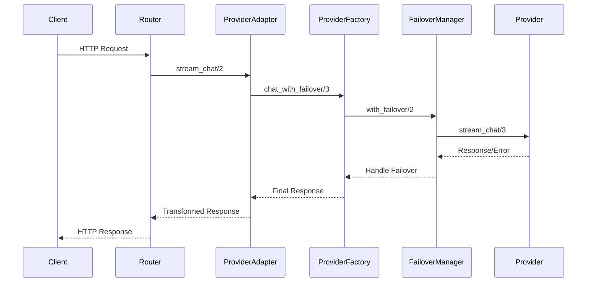
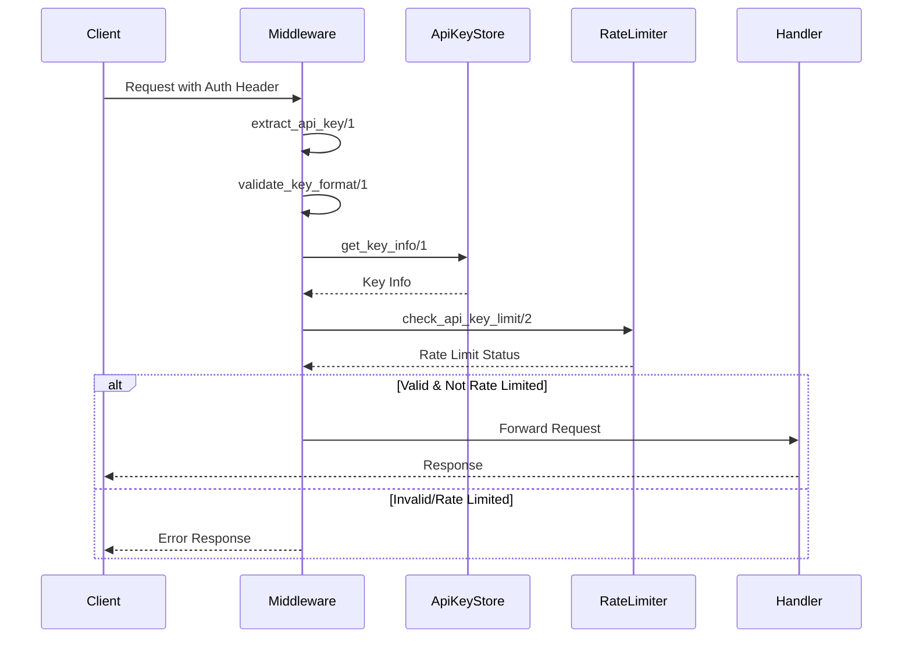
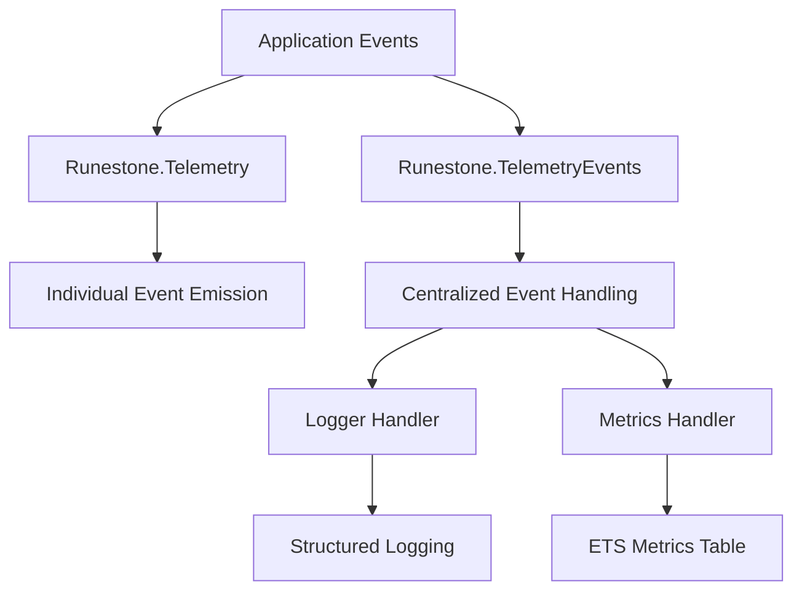

# Runestone Dependency Tree and Module Relationships Analysis

## Overview

This analysis examines the complete dependency tree and module relationships in the Runestone project, focusing on external dependencies, internal module dependencies, provider abstraction layers, authentication middleware, and telemetry integration.

## Executive Summary

Runestone is a well-architected OpenAI-compatible API proxy with a sophisticated provider abstraction layer. The system demonstrates good separation of concerns with clear module boundaries and comprehensive telemetry integration.

### Key Architectural Strengths
- Modular provider abstraction with failover capabilities
- Comprehensive authentication and rate limiting
- Sophisticated telemetry and monitoring
- Clean separation between HTTP layer and business logic
- Resilience patterns (circuit breakers, retries, failover)

### Areas for Improvement
- Module dependency complexity in some areas
- Potential circular dependencies between some modules
- Heavy reliance on GenServer patterns may impact scalability

## 1. External Dependencies Analysis

### Core Framework Dependencies
```elixir
# HTTP & Web Server
:plug_cowboy       # HTTP server (Cowboy with Plug)
:plug             # Web application interface
:plug_crypto      # Cryptographic utilities

# Database & Persistence  
:ecto_sql         # Database wrapper and query generator
:postgrex         # PostgreSQL driver
:oban             # Background job processing

# JSON & HTTP Client
:jason            # JSON parser/encoder
:httpoison        # HTTP client library
:hackney          # HTTP client backend

# Observability
:telemetry        # Metrics and instrumentation
```

### Dependency Risk Assessment

**Low Risk Dependencies:**
- `:plug` - Mature, stable web interface
- `:jason` - Stable JSON handling
- `:telemetry` - Standard observability

**Medium Risk Dependencies:**
- `:httpoison` - HTTP client with known performance limitations
- `:oban` - Background jobs, potential failure point
- `:cowboy` - HTTP server, could be bottleneck

**High Risk Dependencies:**
- `:postgrex` - Database connectivity single point of failure
- `:hackney` - HTTP client backend with memory issues in some versions

## 2. Internal Module Dependencies and Hierarchy

### Application Layer
```
Runestone.Application (OTP Application)
├── Runestone.Repo (Ecto Repository)
├── Runestone.Providers.EnhancedProviderSupervisor
├── Task.Supervisor (Provider Tasks)
├── Runestone.TelemetryEvents
├── Runestone.CircuitBreaker (Legacy)
├── Oban (Job Processing)
├── Runestone.Auth.ApiKeyStore
├── Runestone.Auth.RateLimiter
├── Runestone.RateLimiter (Legacy)
└── Plug.Cowboy (HTTP Servers)
    ├── Runestone.HTTP.Router (Main API)
    └── Runestone.HTTP.Health (Health Checks)
```

### Module Dependency Graph

#### Core HTTP Layer


#### Provider Abstraction Layer


#### Legacy Provider Integration


### Dependency Complexity Analysis

**High Complexity Modules (>5 dependencies):**
1. `Runestone.HTTP.Router` - 8 direct dependencies
2. `Runestone.OpenAIAPI` - 7 direct dependencies  
3. `Runestone.Providers.ProviderFactory` - 6 direct dependencies

**Medium Complexity Modules (3-5 dependencies):**
1. `Runestone.Auth.Middleware` - 4 dependencies
2. `Runestone.Response.UnifiedStreamRelay` - 5 dependencies
3. `Runestone.Application` - 4 major subsystems

**Low Complexity Modules (<3 dependencies):**
- Most utility modules (Telemetry, ErrorResponse, etc.)
- Provider implementations
- Response transformers

## 3. Provider Abstraction Layers

### Three-Layer Provider Architecture

#### Layer 1: Legacy Provider Interface
```elixir
# Simple behavior for backward compatibility
@callback stream_chat(request :: map(), on_event :: (term() -> any())) :: :ok | {:error, term()}

# Implementations:
- Runestone.Provider.OpenAI
- Runestone.Provider.Anthropic
```

#### Layer 2: Enhanced Provider Interface
```elixir
# Advanced provider capabilities
@callback stream_chat(request :: map(), on_event :: function(), config :: map()) :: :ok | {:error, term()}
@callback validate_config(config :: map()) :: :ok | {:error, term()}
@callback provider_info() :: map()
@callback estimate_cost(request :: map()) :: {:ok, float()} | {:error, term()}

# Implementations:
- Runestone.Providers.OpenAIProvider
- Runestone.Providers.AnthropicProvider
```

#### Layer 3: Abstraction Adapter
```elixir
# Bridges legacy and enhanced providers
Runestone.Providers.ProviderAdapter
├── transform_legacy_request/1
├── initialize_default_providers/0
├── get_provider_health/0
└── get_provider_metrics/0
```

### Provider Selection Flow



### Provider Configuration Management

**Environment-Based Configuration:**
```elixir
# OpenAI Provider
OPENAI_API_KEY
OPENAI_BASE_URL (default: https://api.openai.com/v1)
OPENAI_TIMEOUT (default: 120000)
OPENAI_RETRY_ATTEMPTS (default: 3)
OPENAI_CIRCUIT_BREAKER (default: true)

# Anthropic Provider  
ANTHROPIC_API_KEY
ANTHROPIC_BASE_URL (default: https://api.anthropic.com/v1)
ANTHROPIC_TIMEOUT (default: 120000)
ANTHROPIC_RETRY_ATTEMPTS (default: 3)
ANTHROPIC_CIRCUIT_BREAKER (default: true)

# System-wide
PROVIDER_TELEMETRY (default: true)
RUNESTONE_ROUTER_POLICY (default: "default", options: "cost")
```

## 4. Authentication and Middleware Chain

### Authentication Flow



### Middleware Chain Architecture

```elixir
# Plug Pipeline in Runestone.HTTP.Router
plug Plug.Logger
plug :match
plug Plug.Parsers  # JSON parsing
plug Middleware, :bypass_for_health_checks  # Auth middleware
plug :dispatch
```

### Authentication Components

**API Key Store (`Runestone.Auth.ApiKeyStore`):**
- Supports memory and database storage modes
- Key validation and lifecycle management
- Configurable rate limits per key

**Rate Limiter (`Runestone.Auth.RateLimiter`):**
- Per-API-key rate limiting
- Concurrent request tracking
- Configurable limits (requests/minute, requests/hour, concurrent)

**Error Response Handler (`Runestone.Auth.ErrorResponse`):**
- OpenAI-compatible error formats
- Proper HTTP status codes
- Rate limit headers

### Security Features

**API Key Validation:**
- Must start with 'sk-'
- Length validation (10-200 characters)
- Character validation (alphanumeric, dash, underscore)
- Key masking in logs

**Rate Limiting:**
- Multiple limit types (per-minute, per-hour, concurrent)
- Tenant-based isolation
- Overflow queue for rate-limited requests

## 5. Telemetry and Monitoring Integration

### Telemetry Architecture



### Event Categories

**Request Lifecycle Events:**
```elixir
[:runestone, :request, :start]
[:runestone, :request, :stop]
[:runestone, :request, :exception]
```

**Provider Events:**
```elixir
[:runestone, :provider, :request, :start]
[:runestone, :provider, :request, :stop] 
[:runestone, :provider, :request, :exception]
```

**Rate Limiting Events:**
```elixir
[:runestone, :ratelimit, :check]
[:runestone, :ratelimit, :block]
[:runestone, :ratelimit, :allow]
```

**Circuit Breaker Events:**
```elixir
[:runestone, :circuit_breaker, :open]
[:runestone, :circuit_breaker, :close]
[:runestone, :circuit_breaker, :half_open]
```

**HTTP Events:**
```elixir
[:runestone, :http, :request, :start]
[:runestone, :http, :request, :stop]
[:runestone, :http, :request, :exception]
```

### Metrics Collection

**ETS-Based Metrics Storage:**
```elixir
# Table: :runestone_metrics
{:request_duration, tenant} => duration
{:provider_latency, provider} => latency
{:rate_limit_blocks, tenant} => count
{:circuit_breaker, provider} => {state, timestamp}
```

**Background Jobs (Oban):**
- `Runestone.Jobs.MetricsCollector` - Periodic metrics aggregation
- `Runestone.Jobs.HealthCheck` - System health monitoring
- `Runestone.Jobs.OverflowDrain` - Process queued requests

### Enhanced Telemetry Features

**Unified Stream Telemetry:**
```elixir
[:unified_stream, :start] - Stream initiation
[:unified_stream, :chunk] - Individual chunks
[:unified_stream, :complete] - Stream completion
[:unified_stream, :error] - Stream errors
[:unified_stream, :usage] - Token usage
```

**Provider Abstraction Telemetry:**
```elixir
[:provider_factory, :register] - Provider registration
[:provider_factory, :health_check] - Health checks
[:provider_factory, :failover] - Failover events
[:circuit_breaker, :state_change] - Circuit state changes
```

## 6. Code Quality Assessment

### Architecture Quality Score: 8.5/10

**Strengths:**
- Clear separation of concerns
- Comprehensive error handling
- Good use of OTP patterns
- Extensive telemetry coverage
- Resilience patterns implemented

**Areas for Improvement:**
- Some circular dependencies
- Heavy GenServer usage
- Complex module interdependencies
- Legacy code maintenance burden

### Module Coupling Analysis

**Highly Coupled Modules:**
1. `Runestone.HTTP.Router` ↔ `Runestone.OpenAIAPI`
2. `Runestone.Providers.ProviderFactory` ↔ `Runestone.Providers.Resilience.*`
3. `Runestone.Auth.*` modules (tight coupling by design)

**Well-Decoupled Modules:**
1. Individual provider implementations
2. Response transformation modules
3. Utility modules (Telemetry, CostTable)

### Technical Debt Assessment

**Low Technical Debt:**
- Provider abstraction layer (new, well-designed)
- Response transformation system
- Authentication system

**Medium Technical Debt:**
- Legacy provider implementations
- Router complexity
- Mixed old/new patterns

**High Technical Debt:**
- Dual rate limiter implementations
- Legacy circuit breaker alongside new system
- Provider adapter bridging complexity

## 7. Recommendations

### Immediate Improvements

1. **Consolidate Rate Limiting:**
   - Remove legacy `Runestone.RateLimiter`
   - Standardize on `Runestone.Auth.RateLimiter`

2. **Simplify Provider Architecture:**
   - Migrate all providers to enhanced interface
   - Remove `Runestone.Providers.ProviderAdapter`
   - Deprecate legacy provider modules

3. **Reduce Module Coupling:**
   - Extract shared interfaces
   - Use dependency injection patterns
   - Implement event-driven communication

### Long-term Architectural Changes

1. **Microservice Extraction:**
   - Extract authentication service
   - Separate provider management
   - Isolate telemetry aggregation

2. **Performance Optimization:**
   - Replace heavy GenServers with lighter patterns
   - Implement connection pooling
   - Add caching layers

3. **Enhanced Observability:**
   - OpenTelemetry integration
   - Distributed tracing
   - Performance profiling

### Dependency Management

1. **Reduce External Dependencies:**
   - Evaluate `httpoison` alternatives (Finch, Tesla)
   - Consider simpler background job alternatives
   - Minimize database dependencies

2. **Version Management:**
   - Pin critical dependency versions
   - Regular security updates
   - Dependency vulnerability scanning

## Conclusion

Runestone demonstrates a well-architected system with good separation of concerns and comprehensive observability. The dual-layer provider abstraction provides both backward compatibility and modern features. While there are areas for improvement around module coupling and legacy code, the overall architecture is solid and maintainable.

The key strength is the provider abstraction layer with its failover, circuit breaking, and monitoring capabilities. The main area for improvement is consolidating the dual implementations of similar functionality and reducing overall complexity.